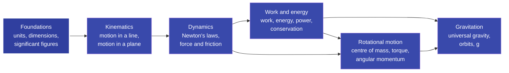

# NEET Physics

Welcome. This is not a cheat sheet, and it is not the textbook either.

Most physics resources fall into one of two traps. The cheat sheets hand you formulas to memorise but never tell you *why* they are true, so the moment a question is phrased a little differently you are stuck. The textbook is correct and complete, but it can feel cold and overwhelming when you are starting from zero. This site tries to sit in the middle: explain every idea as **what it is, why it exists, and why the formula is true**, with pictures, plain language, and the connections between ideas made obvious instead of left for you to work out alone.

Think of it like a patient friend who happens to know physics really well, sitting next to you, drawing on a whiteboard.

!!! intuition "How to read this site"
    Every chapter is layered. Skim the **intuition** box at the top if you just need the gist. Read **how it works** to actually use the formulas. Drop into **why it's true** when you want to see where a formula comes from, not just trust it. You never have to read all of it at once. Every formula and number here is checked against the **NCERT Class 11 Physics** textbook.

## The map

Physics looks like hundreds of unrelated formulas. It is really a handful of ideas that build on each other, left to right.

Start at **Foundations** to learn the language of physics: units, dimensions, and how many digits you are allowed to trust. Then move through **Kinematics** (how things move), **Dynamics** (why they move, Newton's laws), and **Work and energy** (the conservation shortcuts). Finish with **Rotational motion** and **Gravitation**. Each chapter ends by linking to the ones it leans on, so you can follow the threads in any direction. The highlighted node is where to begin.

## Where to begin

**New to physics? Start with Foundations and read top to bottom.** Each chapter builds on the one before it. Already comfortable with the basics? Jump straight to whichever section you need.

-   :material-ruler:{ .lg .middle } **Foundations**

    ---

    The language of physics: units, the seven base quantities, significant figures, and dimensional analysis.

    [:octicons-arrow-right-24: Units and measurement](foundations/units-and-measurement.md)

-   :material-run-fast:{ .lg .middle } **Kinematics**

    ---

    Describe how things move: position, velocity, acceleration, the equations of motion, and projectiles.

    [:octicons-arrow-right-24: Motion in a straight line](kinematics/motion-straight-line.md)

-   :material-arrow-down-bold-box:{ .lg .middle } **Dynamics**

    ---

    Why things move the way they do: Newton's three laws, force, friction, and circular motion.

    [:octicons-arrow-right-24: Laws of motion](dynamics/laws-of-motion.md)

-   :material-lightning-bolt:{ .lg .middle } **Work and energy**

    ---

    The conservation shortcuts: work, kinetic and potential energy, power, and the work-energy theorem.

    [:octicons-arrow-right-24: Work, energy and power](dynamics/work-energy-power.md)

-   :material-rotate-3d-variant:{ .lg .middle } **Rotational motion**

    ---

    Spinning bodies: centre of mass, torque, moment of inertia, and angular momentum.

    [:octicons-arrow-right-24: Rotational motion](rotation/rotational-motion.md)

-   :material-earth:{ .lg .middle } **Gravitation**

    ---

    The force that holds the universe together: universal gravitation, $g$, orbits, and escape speed.

    [:octicons-arrow-right-24: Gravitation](gravitation/gravitation.md)

